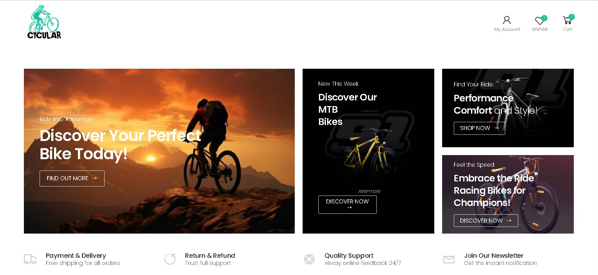

# Cycular-E-com: E-commerce Platform for Selling Cycles

**Cycular-E-com** is an e-commerce platform designed for selling cycles. It features both user-side functionality for a smooth shopping experience and admin-side management tools for tracking and managing sales, products, and users. This project serves as my first comprehensive e-commerce application, created using Django, PostgreSQL, and various other technologies.

<p align="center">
  
</p>

<p align="center">
  <a href="https://cycular.agriflow.space" target="_blank">
    
  </a>
  &nbsp;
  <a href="https://www.youtube.com/watch?v=YOUR_VIDEO_ID" target="_blank">
    
  </a>
  &nbsp;
   <a href="https://www.linkedin.com/posts/vishnu-cheruvakkara-231b8b235_webdevelopment-ecommerce-python-activity-7264316221553020928-oIZA?utm_source=share&utm_medium=member_desktop&rcm=ACoAADq6p4UB7yZEvBWQ6nbkRJlURS5jqlFv_yI" target="_blank">
    
  </a>
</p>


## Key Features

### User Side

- **Authentication:** Secure user sign-up and login with OTP-based authentication and Google Single Sign-On (SSO).
- **Product Browsing:** Browse product details, including price, stock, and ratings.
- **Search and Filtering:** Advanced search and filtering options for cycles based on categories, price, ratings, etc.
- **Cart and Checkout:** Add items to cart and proceed with checkout using Razorpay, Wallet, or Cash on Delivery (COD).
- **Profile Management:** Manage user profile, orders, addresses, and wishlist.

### Admin Side

- **User Management:** Admin can manage users, their activities, and profiles.
- **Product Management:** Admins can manage products, categories, and stock levels.
- **Order Tracking:** Admins can track and update the order status.
- **Sales Reports:** Generate and download sales reports (PDF).
- **Promotions and Discounts:** Manage offers and coupons for better sales.

---

## Technologies Used

- **Frontend:** HTML5, CSS3, JavaScript, Bootstrap
- **Backend:** Django (Python)
- **Database:** PostgreSQL
- **Authentication:** OTP and Google SSO
- **Payment Gateway:** Razorpay
- **Hosting:** AWS
- **Version Control:** Git and GitHub

---

## Installation and Setup

To get started with **Cycular-E-com**, follow these steps:

1. **Clone the repository:**
   ```bash
   https://github.com/VishnuCheruvakkara/Cycular-E-com.git
   cd cycular-ecom
2. **Install required dependencies::**
   ```bash
   pip install -r requirements.txt
3. **Set up environment variables:**
   Configure your database credentials and third-party API keys in the .env file (refer to the .env.example for a template).
4. **Run database migrations:**
   ```bash
   python manage.py makemigrations
   python manage.py migrate
5. **Clone the repository:**
   ```bash
   python manage.py runserver

   
### Development Notes
This project is still a work in progress and not fully containerized with Docker.
For local development, the application is set up using Python and PostgreSQL directly. Docker support will be added in the future for more seamless deployment.


